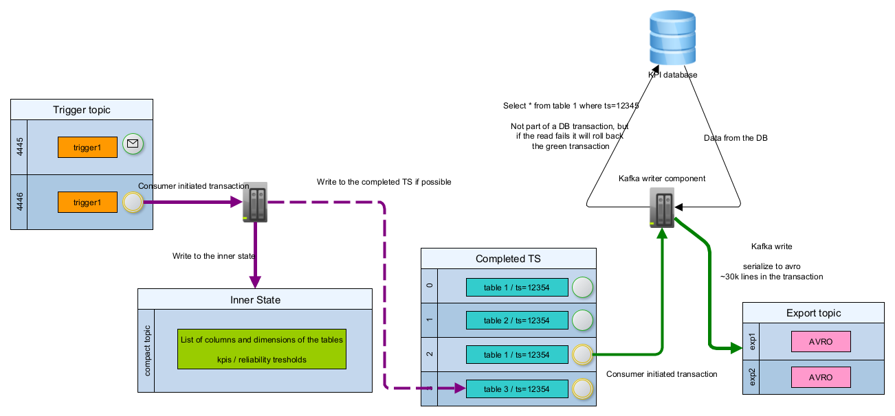
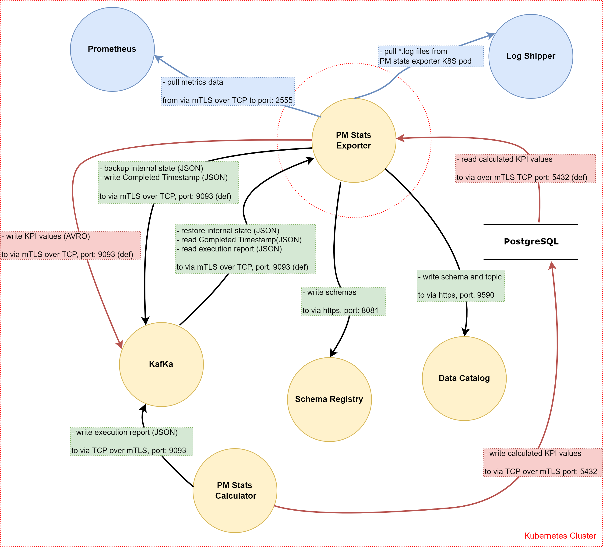

<!--Document Template information:
Prepared:Alex Ajtai, Gergő Molnár
Approved:***
Document Name:pm-stats-exporter-user-guide
Revision: {!.bob/var.user-guide-version!}
Date: {!.bob/var.date!}
-->

# PM Stats Exporter User Guide

- [PM Stats Exporter User Guide](#pm-stats-exporter-user-guide)
    - [Overview](#overview)
        - [Revision History](#revision-history)
        - [Maturing Features](#maturing-features)
        - [Architecture](#architecture)
        - [Deployment View](#deployment-view)
        - [Dimensioning and Characteristics](#dimensioning-and-characteristics)
    - [Deployment](#deployment)
        - [Prerequisites](#prerequisites)
        - [Deployment in a Kubernetes Environment Using Helm](#deployment-in-a-kubernetes-environment-using-helm)
        - [Configuration Parameters](#configuration-parameters)
        - [Service Dimensioning](#service-dimensioning)
        - [Hardening](#hardening)
        - [Upgrade Procedures](#upgrade-procedures)
    - [Security Guidelines](#security-guidelines)
        - [Operative tasks](#operative-tasks)
        - [External Ports](#external-ports)
        - [Internal Ports](#internal-ports)
        - [Certificates](#certificates)
        - [Security Events That Can Be Logged](#security-events-that-can-be-logged)
    - [Privacy User Guidelines](#privacy-user-guidelines)
    - [Operation and Maintenance](#operation-and-maintenance)
        - [Metrics](#metrics)
        - [Backup and Restore](#backup-and-restore)
    - [Troubleshooting](#troubleshooting)
        - [Prerequisites](#prerequisites-1)
        - [Health Checks](#health-checks)
        - [Installation](#installation)
        - [Logs](#logs)
        - [Deletion of Release](#deletion-of-release)
        - [Bug Reporting and Additional Support](#bug-reporting-and-additional-support)
        - [Recovery Procedure](#recovery-procedure)
        - [Known Issues](#known-issues)
    - [References](#references-1)

## Overview

The PM Stats Exporter is a microservice within the PM Stats Calculation Handling app. Its main responsibility is to read the rows of calculated KPI values and dimensions - sent by the PM Stats Calculator - from the PostgreSQL database and export them to Kafka in Avro format.

### Revision History

| Date       | Revision | Comment                                                                                     | Author                   |
|------------|----------|---------------------------------------------------------------------------------------------|--------------------------|
| 11/11/2022 | 1.0.0    | Initial Version                                                                             | Alex Ajtai, Gergő Molnár |
| 13/12/2022 | 1.1.0    | Update with HA functionality                                                                | Alex Ajtai               |
| 04/01/2023 | 1.1.1    | Updated Deployment with retry values                                                        | Alex Molnár              |
| 13/07/2023 | 1.2.0    | Update Overview chapter                                                                     | Alex Ajtai               |
| 24/07/2023 | 1.3.0    | Update Deployment, Security Guidelines, Operation and Maintenance, Troubleshooting chapters | Alex Ajtai               |

### Maturing Features

Currently, there are no Alpha and Beta Features in the Exporter.

### Architecture

There are two main transaction processes in the PM Stats Exporter.

The first one is to read the incoming execution reports - generated by the PM Stats Calculator - from Kafka and create or update statuses for every table read from the execution reports and put these statuses into the inner state and then send completed timestamp messages - created from the table statuses - at scheduled time period or on-demand time period to the corresponding Kafka topic in Json format.

Secondly, the Exporter - according to the information in the received completed timestamp messages sent by Kafka and the calculated KPI values and dimensions read from PostgreSql - creates Avro schemas which are registered in both the Schema Registry and the Data Catalog (with the registered schema ID and the corresponding topic name). After the process, the message is sent to Kafka in Avro format.

The following picture shows the PM Stats Exporter and its architectural context.



Figure 1 Architecture view of The PM Stats Exporter.

#### Logical Interfaces

| Interface Logical Name | Interface Realization                                                                                                                          | Description                                                                                                                                                                                                 | Interface Maturity  |
|------------------------|------------------------------------------------------------------------------------------------------------------------------------------------|-------------------------------------------------------------------------------------------------------------------------------------------------------------------------------------------------------------|---------------------|
| Apache Kafka           | [https://kafka.apache.org/](https://kafka.apache.org/)                                                                                         | The PM Stats Exporter receives execution reports and completed timestamps from Kafka topics and sends calculated KPI data in Avro format to Kafka as well.                                                  | Stable              |
| PostgreSQL             | [https://www.postgresql.org/](https://www.postgresql.org/)                                                                                     | The PM Stats Exporter reads calculated KPI data - sent by the PM Stats Calculator - from PostgreSQL.                                                                                                        | Stable              |
| Data Catalog           | [https://adp.ericsson.se/marketplace/data-catalog](https://adp.ericsson.se/marketplace/data-catalog)                                           | The PM Stats Exporter sends schema related data to Data Catalog, specifically in which topic the schema is stored in Kafka and the schema ID.                                                               | Stable              |
| Schema Registry        | [https://docs.confluent.io/platform/current/schema-registry/index.html](https://docs.confluent.io/platform/current/schema-registry/index.html) | The PM Stats Exporter creates Avro schemas from the completed timestamp messages and the KPI data read from PostgreSQL and stores them in the Schema Registry to prevent unsupported data format streaming. | Stable              |
| Prometheus             | [https://prometheus.io/](https://prometheus.io/)                                                                                               | With the help of Prometheus, a lot of metrics can be queried from the Exporter including the number of scheduled execution reports read from Kafka, the number of rows read from PostgreSql.                | Stable              |

#### Application Programming Interfaces (APIs)

Currently, there are no API-s in the PM Stats Exporter.

### Deployment View

The PM Stats Exporter is packaged as a Docker container. It supports deployment in Kubernetes using Helm.

Figure 2 below is the deployment view of the PM Stats Exporter in the Kubernetes Cluster.



To deploy the Service, refer to the Deployment section, which:

- explains how to get started using the PM Stats Exporter Service in the supported environments.
- specifies configuration options for starting the PM Stats Exporter docker container.

If any problem occurs while using the service, refer to the Troubleshooting section.

### Dimensioning and Characteristics

#### Physical Dimensioning

| Microservices     | Memory Requested | Memory Limit | CPU requested | CPU limit |
|-------------------|------------------|--------------|---------------|-----------|
| PM Stats Exporter | 8 GB             | 12 GB        | 6000(m)       | 12000(m)  |

#### Scaling

| Scaling Supported (Yes/No) | Minimum number of instances | Maximum number of recommended instances |
|----------------------------|-----------------------------|-----------------------------------------|
| Yes                        | 2                           | 10                                      |

#### Resilience

For the high availability of the PM Stats Exporter, the two transactions of the microservice are implemented
in different ways.

The first transaction is about the dataflow starting from DMM Kafka. The data goes into
the Inner State of the PM Stats Exporter and thereafter into the Completed Timestamp topic.
The elected Master pod is handling this transaction. If it dies for some reason then a new Master pod is elected from the Slave pods. Data is neither
lost nor duplicated during Master pod election.

The second transaction describes the following dataflow. The data comes from both the Completed Timestamp topic
and PostgresSql and goes into the PM Stats Exporter and after that into the Scheduled/Ondemand topic in DMM Kafka. This transaction is
implemented by parallel processing of partitioning the Completed Timestamp topic with keys. With the intention of
fixing the connection issue regarding timestamp-table-consumer, the table name is used as the key.

The Kafka producers write the data to the partitioned Kafka topic and the Kafka consumers are grouped in a consumer group, so the partitions
are evenly distributed between the members. The number of partitions is the maximum number of working pods.

On startup, the PM Stats Exporter checks the availability of PostgreSQL, Kafka and
the required topics (Completed Timestamp topic, Backup topic, Execution Report topic).

Additionally, PM Stats Exporter checks the availability of the Schema Registry when writing data into the corresponding
Kafka topic (Ondemand or Scheduled topic) or updating the compatibility for an execution report table.

These dependency checks have their own retry mechanisms containing unique configurations like back-off periods, and max attempts.

In addition, the health status of the PM Stats Exporter, Data Catalog, Kafka and Schema Registry can be queried anytime while
the PM Stats Exporter is running.

#### Upgrade - In Service Software Upgrade

In the Pre Code Review and Publish Jenkinsfile there is a HELM_UPGRADE field which would trigger a helm upgrade bob rule during the CI flow.

## Deployment

This section describes the operational procedures for how to deploy and upgrade
the PM Stats Exporter Service in a Kubernetes environment with Helm. It also
covers hardening guidelines to consider when deploying this service.

### Prerequisites

-  A running Kubernetes environment with helm support, some knowledge
   of the Kubernetes environment, including the networking detail, and
   access rights to deploy and manage workloads.

-   Availability of the kubectl CLI tool with correct authentication
    details. Contact the Kubernetes System Admin if necessary.

-   Availability of the helm package.

-   Availability of Helm charts and Docker images for the service and
    all dependent services.

### Deployment in a Kubernetes Environment Using Helm

This section describes how to deploy the service in Kubernetes using Helm and
the `kubectl` CLI client. Helm is a package manager for Kubernetes that
streamlines the installation and management of Kubernetes applications.

#### Preparation

Prepare helm chart and docker images. Helm chart in the following link
can be used for installation:

[Helm Chart Package](https://arm.seli.gic.ericsson.se/artifactory/proj-eric-oss-drop-helm/eric-oss-pm-stats-exporter/)

#### Pre-Deployment Checks for PM Stats Exporter

Ensure the following:

- The release name is not used already in the corresponding cluster.
  Use `helm list -n <namespace>` command to list the existing deployments (and delete previous
  deployment with the corresponding release name if needed).

- The same namespace is used for all deployments.

- A secret containing Armdocker registry login credentials exists.

- A secret named eric-oss-pm-stats-calculator-kpi-data containing postgres database login credentials exists.

- "pm-stats-calculator-json-execution-report" topic exists on Kafka.

#### Helm Chart Installations of Dependent Services

- Install Strimzi Kafka - Please refer to [Strimzi Kafka Service User Guide's Deployment Section](https://adp.ericsson.se/marketplace/kf-operator-sz/documentation/1.1.0-31/dpi/service-user-guide#strimziuserguide-deploymentview)

- Install Schema Registry - Please refer to [Schema Registry's Service User Guide's Deployment Section](https://adp.ericsson.se/marketplace/schema-registry-sr/documentation/1.32.0/dpi/service-user-guide)

- Install Data Catalog - Please refer to [Data Catalog's User Guide's Deployment Section](https://adp.ericsson.se/marketplace/data-catalog/documentation/development/additional-documents/user-guide#deployment)

- Install PM Stats Calculator - Please refer to [Install PM Stats Calculator's Service User Guide's Deployment Section](https://adp.ericsson.se/marketplace/pm-stats-calculator/documentation/1.185.0-1/dpi/service-user-guide#deployment)

#### Helm Chart Installation of PM Stats Exporter Service

>**_Note:_** Ensure all dependent services are deployed and healthy before you
>continue with this step (see previous chapter).

Helm is a tool that streamlines installing and managing Kubernetes
applications. PM Stats Exporter can be deployed on Kubernetes using
Helm Charts. Charts are packages of pre-configured Kubernetes resources.

Users can override the default values provided in the values.yaml template of
the helm chart. The recommended parameters to override are listed in the
following section: [Configuration Parameters](#configuration-parameters).

##### Deploy the PM Stats Exporter Service

- *deployment with mandatory parameters only;*
- *deployment with some optional parameters.*

Install the PM Stats Exporter on the Kubernetes cluster by using the
helm installation command:

```text
helm install <CHART_REFERENCE> --name <RELEASE_NAME> --namespace <NAMESPACE> --set kafka.enabled=true,eric-pm-kpi-data.enabled=true,dmm.enabled=true,<other_parameters>
```

The variables specified in the command are as follows:

- `<CHART_REFERENCE>`: A path to a packaged chart, a path to an unpacked chart
  directory or a URL.

- `<RELEASE_NAME>`: String value, a name to identify and manage your helm chart.

- `<NAMESPACE>`: String value, a name to be used dedicated by the user for
  deploying own helm charts.

- `<ARMDOCKER_SECRET>`: String value, the name of the secret containing the armdocker login credentials.

###### Examples

Install the PM Stats Exporter with mandatory config values.

```text
helm install <CHART_REFERENCE> --name <RELEASE_NAME> --namespace <NAMESPACE> --set imageCredentials.eric-oss-pm-stats-exporter.pullSecret=<ARMDOCKER_SECRET>,kafka.enabled=true,eric-pm-kpi-data.enabled=true,dmm.enabled=true,kafka.brokerAddress=eric-oss-dmm-kf-op-sz-kafka-bootstrap
```

##### Verify the PM Stats Exporter Service Availability

To verify whether the deployment is successful, do as follows:

1.  Check if the chart is installed with the provided release name and
    in related namespace by using the following command:

```text
$helm ls -n <namespace>
```

Chart status should be reported as "DEPLOYED".

2.  Verify the status of the deployed helm chart.

```text
$helm status -n <namespace> <release_name>
```

Chart status should be reported as "DEPLOYED". All Pods status should be
reported as "Running" and number of Deployment Available should be the
same as the replica count.

3.  Verify that the pods are running
    by getting the status for your pods.

```text
$kubectl get pods --namespace=<namespace> -L role
```

For example:

```text
$helm ls -n example
$helm status -n example examplerelease
$kubectl get pods --namespace=example -L role
```

All pods status should be "Running". All containers in any pod should
be reported as "Ready". There is one POD marked as the master role and
the other PODs are marked as the replica role.

### Configuration Parameters

#### Mandatory Configuration Parameters

The parameters in following table are mandatory to set at deployment time.
If not provided, the deployment will fail. There are no default values
provided for this type of parameters.

| Variable Name                                          | Description                                                                                 |
|--------------------------------------------------------|---------------------------------------------------------------------------------------------|
| imageCredentials.eric-oss-pm-stats-exporter.pullSecret | String value, name of the secret containing the login credentials to the Armdocker registry |

#### Optional Configuration Parameters

Following parameters are not mandatory. If not explicitly set
(using the --set argument), the default values provided
in the helm chart are used.

Note, that if you add up the retry values (times the maximum amount of retries),
it shouldn't be more, than the initial delay seconds specified for the k8s probes,
otherwise kubernetes will restart the container, before it could start properly.

| Variable Name                                                               | Description                                                                                                                                                                                                                      | Default Value                                |
|-----------------------------------------------------------------------------|----------------------------------------------------------------------------------------------------------------------------------------------------------------------------------------------------------------------------------|----------------------------------------------|
| affinity.podAntiAffinity                                                    | String value, determines the default pod anti affinity                                                                                                                                                                           | "soft"                                       |
| affinity.topologyKey                                                        | String value, determines the topology key to use as the failure domain                                                                                                                                                           | "kubernetes.io/hostname"                     |
| annotations                                                                 | Set value, determines the set of the default annotations of the microservice                                                                                                                                                     | {}                                           |
| appArmorProfile.type                                                        | String value, app armor profile setting. This value should be set to "unconfined" when deploying on a local environment on a windows machine                                                                                     | ""                                           |
| autoScaling.enabled                                                         | Boolean value, determines whether autoscaling is enabled or not                                                                                                                                                                  | false                                        |
| autoScaling.maxReplicas                                                     | Integer value, determines the default maximum replicas of the pod                                                                                                                                                                | 100                                          |
| autoScaling.minReplicas                                                     | Integer value, determines the default minimum replicas of the pod                                                                                                                                                                | 1                                            |
| autoScaling.targetCPUUtilizationPercentage                                  | Integer value, determines the default target CPU utilization percentage                                                                                                                                                          | 80                                           |
| cnomServer.enabled                                                          | Boolean value, determines whether CNOM auto-discovery is enabled or not                                                                                                                                                          | true                                         |
| dmm.dataCatalog.nameOverride                                                | String value, name of the DataCatalog deployment                                                                                                                                                                                 | "eric-oss-data-catalog"                      |
| dmm.dataCatalog.service.port                                                | Integer value, the port DataCatalog is listening on                                                                                                                                                                              | 9590                                         |
| dmm.enabled                                                                 | Boolean value, determines whether DataCatalog is enabled or not                                                                                                                                                                  | false                                        |
| dst.collector.host                                                          | String value, sets the host for DST collector                                                                                                                                                                                    | "http://eric-dst-collector"                  |
| dst.collector.portJaegerGrpc                                                | Integer value, sets the port for Jaeger using GRPC                                                                                                                                                                               | 14250                                        |
| dst.collector.portOtlpGrpc                                                  | Integer value, sets the port for DST collector when using GRPC                                                                                                                                                                   | 4317                                         |
| dst.collector.portOtlpHttp                                                  | Integer value, sets the port for DST collector when using HTTP                                                                                                                                                                   | 4318                                         |
| dst.collector.protocol                                                      | String value, sets the protocol for DST collector. Valid values are "http" or "grpc"                                                                                                                                             | "http"                                       |
| dst.enabled                                                                 | Boolean value, determines whether tracing is enabled or not                                                                                                                                                                      | true                                         |
| dst.producer.type                                                           | String value, sets the producer type for DST. Valid values are "B3" or "W3C" or "B3,W3C"                                                                                                                                         | "B3"                                         |
| eric-pm-kpi-data.credentials.roUserName                                     | String value, user name of the read-only Postgres user, which is used when TLS is enabled                                                                                                                                        | "kpi_service_user_ro"                        |
| eric-pm-kpi-data.credentials.keyForSuperPw                                  | String value, The Kubernetes super user password for Postgres                                                                                                                                                                    | "super-pwd"                                  |
| eric-pm-kpi-data.credentials.keyForUserId                                   | String value, The Kubernetes user ID for Postgres                                                                                                                                                                                | "username"                                   |
| eric-pm-kpi-data.credentials.keyForUserPw                                   | String value, The Kubernetes user password for Postgres                                                                                                                                                                          | "password"                                   |
| eric-pm-kpi-data.credentials.kubernetesSecretName                           | String value, The Kubernetes secret name of Postgres                                                                                                                                                                             | "eric-oss-pm-stats-calculator-kpi-data"      |
| eric-pm-kpi-data.enabled                                                    | Boolean value, determines whether the Postgres is enabled or not                                                                                                                                                                 | false                                        |
| eric-pm-kpi-data.nameOverride                                               | String value, name of the Postgres deployment                                                                                                                                                                                    | "eric-pm-kpi-data-v2"                        |
| eric-pm-kpi-data.postgresDatabase                                           | String value, name of the database inside the Postgres deployment                                                                                                                                                                | "kpi_service_db"                             |
| eric-pm-kpi-data.service.port                                               | Integer value, the port Postgres is listening on                                                                                                                                                                                 | 5432                                         |
| eric-pm-server.rbac.appMonitoring.enabled                                   | Boolean value, determines whether monitoring is enabled for eric-pm-server                                                                                                                                                       | true                                         |
| fullnameOverride                                                            | String value, determines the full overridden name of the microservice                                                                                                                                                            | ""                                           |
| imageCredentials.eric-oss-pm-stats-exporter.registry                        | Set value, determines the set of the image credentials registry                                                                                                                                                                  | {}                                           |
| imageCredentials.eric-oss-pm-stats-exporter.repoPath                        | String value, determines the image credentials repo path for the microservice                                                                                                                                                    | "REPO_PATH"                                  |
| imagePullSecrets                                                            | List value, determines the list of the image pull secrets                                                                                                                                                                        | []                                           |
| kafka.backup.partitions                                                     | Integer value, number of partitions of backup topic                                                                                                                                                                              | 1                                            |
| kafka.backup.replicationFactor                                              | Integer value, Replication Factor of backup topic on Kafka, this value should be equal to, or less than number of available Kafka brokers                                                                                        | 3                                            |
| kafka.backup.topicName                                                      | String value, name of the topic, where the backup messages will be exported to, and read from.                                                                                                                                   | "pm-stats-exporter-json-backup"              |
| kafka.brokerAddress                                                         | String value, name of the Kafka deployment used by the service                                                                                                                                                                   | "eric-data-message-bus-kf"                   |
| kafka.brokerPort                                                            | Integer value, the port Kafka is listening on                                                                                                                                                                                    | 9092                                         |
| kafka.brokerPortTls                                                         | Integer value, the port Kafka is listening on with TLS enabled                                                                                                                                                                   | 9093                                         |
| kafka.completedTimestamp.partitions                                         | Integer value, number of partitions of completedTimestamp topic                                                                                                                                                                  | 10                                           |
| kafka.completedTimestamp.replicationFactor                                  | Integer value, replication factor of completedTimestamp topic on Kafka, this value should be equal to, or less than number of available Kafka brokers                                                                            | 3                                            |
| kafka.completedTimestamp.topicName                                          | String value, name of the topic, where completed timestamp messages will be exported to                                                                                                                                          | "pm-stats-exporter-json-completed-timestamp" |
| kafka.consumer.groupId                                                      | String value, the group ID of the Kafka consumer                                                                                                                                                                                 | "eric-oss-pm-stats-exporter"                 |
| kafka.producer.avro.linger                                                  | Integer value, the amount of time (in milliseconds) the avro producer is willing to wait before sending out a batch                                                                                                              | 0                                            |
| kafka.producer.avro.batchSize                                               | Integer value, the maximum size (in bytes) of a batch for the avro producer                                                                                                                                                      | 65536                                        |
| kafka.producer.avro.compressionType                                         | String value, avro producer's compression type for sending messages                                                                                                                                                              | "gzip"                                       |
| kafka.enabled                                                               | Boolean value, determines whether Kafka is enabled or not                                                                                                                                                                        | false                                        |
| kafka.executionReport.topicName                                             | String value, name of the topic, where execution report messages will be read from                                                                                                                                               | "pm-stats-calculator-json-execution-report"  |
| kafka.onDemand.partitions                                                   | Integer value, number of partitions of onDemand topic                                                                                                                                                                            | 1                                            |
| kafka.onDemand.replicationFactor                                            | Integer value, Replication Factor of onDemand topic on Kafka, this value should be equal to, or less than number of available Kafka brokers                                                                                      | 3                                            |
| kafka.onDemand.topicName                                                    | String value, name of the topic, where onDemand messages will be exported to                                                                                                                                                     | "pm-stats-calc-handling-avro-on-demand"      |
| kafka.scheduled.partitions                                                  | Integer value, number of partitions of scheduled topic                                                                                                                                                                           | 1                                            |
| kafka.scheduled.replicationFactor                                           | Integer value, Replication Factor of scheduled topic on Kafka, this value should be equal to, or less than number of available Kafka brokers                                                                                     | 3                                            |
| kafka.scheduled.topicName                                                   | String value, name of the topic, where scheduled messages will be exported to                                                                                                                                                    | "pm-stats-calc-handling-avro-scheduled"      |
| kafka.schemaRegistryUrl                                                     | String value, URL of schema registry's endpoint                                                                                                                                                                                  | "http://eric-schema-registry-sr:8081/"       |
| labels                                                                      | Set value, determines the set of the default labels of the microservice                                                                                                                                                          | {}                                           |
| leaderConfigMapName                                                         | String value, determines the default leader config map name                                                                                                                                                                      | "pm-stats-exporter-leader-configmap"         |
| log.logControlFile                                                          | String value, determines the default log control file location                                                                                                                                                                   | "/logcontrol/logcontrol.json"                |
| log.logLevel                                                                | String value, determines the default log level                                                                                                                                                                                   | "INFO"                                       |
| log.logstash_destination                                                    | String value, determines the default name of the log stash destination                                                                                                                                                           | "eric-log-transformer"                       |
| log.logstash_port                                                           | Integer value, determines the default value of the log stash port                                                                                                                                                                | 9080                                         |
| log.streamingMethod                                                         | String value, determines the log streaming method. The default value is determined by global.log.streamingMethod.                                                                                                                |                                              |
| meterCollectors.enabled                                                     | Boolean value, determines whether the collectors for multi-gauge metrics are enabled or not.                                                                                                                                     | true                                         |
| meterCollectors.retentionSeconds                                            | Integer value, determines the length of the retention period for the multi-gauge base data collections, measured in seconds.                                                                                                     | 14400                                        |
| nameOverride                                                                | String value, determines the overridden name of the microservice                                                                                                                                                                 | ""                                           |
| nodeSelector                                                                | Set value, determines the set of node selectors                                                                                                                                                                                  | {}                                           |
| podAnnotations                                                              | Set value, determines the set of the default pod annotations of the microservice                                                                                                                                                 | {}                                           |
| podDisruptionBudget.minAvailable                                            | Integer value or percentage, the number of pods that must still be available after the eviction, only one of this or podDisruptionBudget.maxUnavailable can be in effect at a time. If both are set this takes precedence.       | 1                                            |
| podDisruptionBudget.maxUnavailable                                          | Integer value or percentage, the maximum number of pods that can be evicted, only one of this or podDisruptionBudget.minAvailable can be in effect at a time. If both are set podDisruptionBudget.minAvailable takes precedence. | ""                                           |
| podPriority.eric-oss-pm-stats-exporter.priorityClassName                    | String value, determines the pod priority class name                                                                                                                                                                             | ""                                           |
| podSecurityContext.supplementalGroups                                       | Integer value, determines the default value of pod security supplemental groups                                                                                                                                                  | null                                         |
| probes.eric-oss-pm-stats-exporter.livenessProbe.failureThreshold            | Integer value, sets the default value of the failure threshold of the liveness probe                                                                                                                                             | 3                                            |
| probes.eric-oss-pm-stats-exporter.livenessProbe.initialDelaySeconds         | Integer value, sets the amount of time it takes to start the liveness probe                                                                                                                                                      | 110                                          |
| probes.eric-oss-pm-stats-exporter.livenessProbe.periodSeconds               | Integer value, sets the default value for how long the liveness probe should last in seconds                                                                                                                                     | 10                                           |
| probes.eric-oss-pm-stats-exporter.livenessProbe.timeoutSeconds              | Integer value, sets the time out for the liveness probe in seconds                                                                                                                                                               | 10                                           |
| probes.eric-oss-pm-stats-exporter.readinessProbe.failureThreshold           | Integer value, sets the default value of the failure threshold of the readiness probe                                                                                                                                            | 3                                            |
| probes.eric-oss-pm-stats-exporter.readinessProbe.initialDelaySeconds        | Integer value, sets the amount of time it takes to start the readiness probe                                                                                                                                                     | 110                                          |
| probes.eric-oss-pm-stats-exporter.readinessProbe.periodSeconds              | Integer value, sets the default value for how long the readiness probe should last in seconds                                                                                                                                    | 10                                           |
| probes.eric-oss-pm-stats-exporter.readinessProbe.timeoutSeconds             | Integer value, sets the time out for the readiness probe in seconds                                                                                                                                                              | 10                                           |
| prometheus.path                                                             | String value, determines the default path of prometheus                                                                                                                                                                          | "/actuator/prometheus"                       |
| prometheus.scrape                                                           | Boolean value, determines whether prometheus is scraped or not                                                                                                                                                                   | true                                         |
| replicaCount                                                                | Integer value, determines the default replica count for the pod                                                                                                                                                                  | 1                                            |
| resources.eric-oss-pm-stats-exporter.jvm.initialMemoryAllocationPercentage  | String value, determines the default initial memory allocation percentage request for the microservice                                                                                                                           | 50                                           |
| resources.eric-oss-pm-stats-exporter.jvm.largeMemoryAllocationMaxPercentage | String value, determines the default large memory allocation percentage request for the microservice                                                                                                                             | 75                                           |
| resources.eric-oss-pm-stats-exporter.jvm.smallMemoryAllocationMaxPercentage | String value, determines the default small memory allocation percentage request for the microservice                                                                                                                             | 70                                           |
| resources.eric-oss-pm-stats-exporter.limits.cpu                             | String value, determines the default maximum CPU resource request for the microservice                                                                                                                                           | "500m"                                       |
| resources.eric-oss-pm-stats-exporter.limits.ephemeral-storage               | String value, determines the default maximum ephemeral storage resource request for the microservice                                                                                                                             | "2Gi"                                        |
| resources.eric-oss-pm-stats-exporter.limits.memory                          | String value, determines the default maximum memory resource request for the microservice                                                                                                                                        | "2Gi"                                        |
| resources.eric-oss-pm-stats-exporter.requests.cpu                           | String value, determines the default minimum CPU resource request for the microservice                                                                                                                                           | "125m"                                       |
| resources.eric-oss-pm-stats-exporter.requests.ephemeral-storage             | String value, determines the default minimum ephemeral storage resource request for the microservice                                                                                                                             | "1Gi"                                        |
| resources.eric-oss-pm-stats-exporter.requests.memory                        | String value, determines the default minimum memory resource request for the microservice                                                                                                                                        | "256Mi"                                      |
| retry.kafka.backoffPeriod                                                   | Integer value, waiting time before every retry, if kafka is not available                                                                                                                                                        | 5000                                         |
| retry.kafka.maxAttempts                                                     | Integer value, maximum number of retries if kafka is not available                                                                                                                                                               | 5                                            |
| retry.postgres.backoffPeriod                                                | Integer value, waiting time before every retry, if postgres is not available                                                                                                                                                     | 5000                                         |
| retry.postgres.maxAttempts                                                  | Integer value, maximum number of retries if postgres is not available                                                                                                                                                            | 5                                            |
| retry.sr.backoffPeriod                                                      | Integer value, waiting time before every retry, if schema registry not available                                                                                                                                                 | 1000                                         |
| retry.sr.maxAttempts                                                        | Integer value, maximum number of retries if schema registry not available                                                                                                                                                        | 5                                            |
| retry.topics.backoffPeriod                                                  | Integer value, waiting time before every retry, if topics are not available                                                                                                                                                      | 1000                                         |
| retry.topics.maxAttempts                                                    | Integer value, maximum number of retries if topics are not available                                                                                                                                                             | 5                                            |
| seccompProfile.type                                                         | String value, determines the default profile for Seccomp                                                                                                                                                                         | "RuntimeDefault"                             |
| securityPolicy.rolename                                                     | String value, set role name for the role binding                                                                                                                                                                                 | "eric-oss-pm-stats-exporter"                 |
| service.endpoints.chassisapi.tls.enforced                                   | String value, determines whether the tls is required for the service endpoint or not                                                                                                                                             | "required"                                   |
| service.endpoints.chassisapi.tls.verifyClientCertificate                    | String value, determines whether the tls client certificate is required for the service endpoint or not                                                                                                                          | "required"                                   |
| service.port                                                                | Integer value, determines the default service port                                                                                                                                                                               | 8080                                         |
| service.type                                                                | String value, determines the default service type                                                                                                                                                                                | "ClusterIP"                                  |
| serviceAccount.create                                                       | Boolean value, determines whether service account is required or not                                                                                                                                                             | true                                         |
| serviceAccount.name                                                         | String value, determines the name of the service account                                                                                                                                                                         | ""                                           |
| terminationGracePeriodSeconds                                               | Integer value, determines the default value of termination grace seconds                                                                                                                                                         | 30                                           |
| tolerations.effect                                                          | String value, if a taint with effect NoExecute is added to a node, then any pods that do not tolerate the taint will be evicted immediately, and pods that do tolerate the taint will never be evicted                           | "NoExecute"                                  |
| tolerations.key                                                             | String value, the Node controller adds the taint to a Node corresponding to the NodeCondition Ready being Unknown. Node is unreachable from the node controller. This corresponds to the NodeCondition Ready being "Unknown".    | "node.kubernetes.io/not-ready"               |
| tolerations.key                                                             | String value, the Node controller adds the taint to a Node corresponding to the NodeCondition Ready being Unknown. Node is unreachable from the node controller. This corresponds to the NodeCondition Ready being "Unknown".    | "node.kubernetes.io/unreachable"             |
| tolerations.operator                                                        | String value, a toleration "matches" a taint if the keys are the same and the effects are the same, and operator is set to "Exists" (in which case no value should be specified)                                                 | "Exists"                                     |
| tolerations.tolerationSeconds                                               | Integer value, tolerationSeconds field that dictates how long the pod will stay bound to the node after the taint is added                                                                                                       | 0                                            |
| topologySpreadConstraints.deployment                                        | List value, determines the list of the default topology constraints deployments                                                                                                                                                  | []                                           |
| topologySpreadConstraints.test                                              | List value, determines the default topology constraints tests                                                                                                                                                                    | []                                           |
| updateStrategy.rollingUpdate.maxSurge                                       | Integer value, determines the value of the max surge of the rolling update strategy                                                                                                                                              | 1                                            |
| updateStrategy.rollingUpdate.maxUnavailable                                 | Integer value, determines the value of the max unavailable rolling update strategy                                                                                                                                               | 0                                            |
| updateStrategy.type                                                         | String value, determines the update strategy                                                                                                                                                                                     | "RollingUpdate"                              |


### Service Dimensioning

Dimensioning for Pm Stats Exporter Service mostly depends on data in the Database.
There will be a Characteristic Test which will provide reference numbers, the performance with
given configuration including environment, resource. This will be just references.
With another environment or resource, the performance needs to be tested and tuned accordingly.
The service provides minimum configuration as part of the Helm chart.

#### Override Default Dimensioning Configuration

The default resource request and resource limit values must be overridden at deployment time, if you want to use non-default values.

Here is an example of the `helm install` command where resource requests and
resource limits are set:

```text
helm install https://arm.seli.gic.ericsson.se/artifactory/proj-eric-oss-drop-helm/eric-oss-pm-stats-exporter/eric-oss-pm-stats-exporter-1.0.79-0.tgz --name eric-oss-pm-stats-exporter --namespace test-deployment-namespace --set resources.eric-oss-pm-stats-exporter.requests.memory=512Mi resources.eric-oss-pm-stats-exporter.requests.cpu=250m resources.eric-oss-pm-stats-exporter.requests.ephemeral-storage=2Gi
```

#### Default Minimum Configuration per Service Instance

This chapter specifies the default minimum provided configuration per service
instance.

| Resource Type (Kubernetes Service) | Resource Request Memory | Resource Limit Memory | Resource Request CPU | Resource Limit CPU | Ephemeral Storage Request | Ephemeral Storage Limit  |
|------------------------------------|-------------------------|-----------------------|----------------------|--------------------|---------------------------|--------------------------|
| PM Stats Exporter                  | 256Mi                   | 2Gi                   | 125m                 | 500m               | 1Gi                       | 2Gi                      |

To change this configuration, override the default values for resource requests
and resource limits in the helm chart at deployment time.

### Hardening

>**_Todo:_** This Section is a placeholder at the moment.
> Waiting for Hardening part of RA and PIA report to be made. (part of [IDUN-33792](https://jira-oss.seli.wh.rnd.internal.ericsson.com/browse/IDUN-33792))

#### Hardening during product development

<*List of the hardening activities that are relevant for product deployment but
have been performed during product development must be covered in this section.
This information may include description of automated procedures, scripts,
step-by-step instructions, or give references to a respective instruction
document in CPI.*><br/><br/>
<*List specific pre-hardening actions made for this service*>

#### Hardening during service delivery

<*All applicable hardening activities that were not covered in previous section
and should be implemented during service delivery, operations and maintenance
(deployment, integration, modification (update/upgrade) etc.,) must be covered
in this section.<br/>
This section shall describe the instructions on how to perform the remaining
hardening activities in the service delivery phase, and during the operation
and maintenance phase.<br/>
These instructions shall describe automated procedures, scripts, step-by-step
instructions (for example SCC, Apparmor, etc.) or by giving references to a
relevant instruction document in CPI).*><br/><br/>
<*List specific hardening actions made for this service*>

#### Automated procedures and hardening scripts

<*In case hardening scripts have been developed for the product, they should be
delivered along with the product’s software package in the software gateway.
A respective reference should be made in the Hardening Guideline under the
relevant sections pointing out the name of the scripts, their exact locations
and explaining the purpose of each script, and how to execute and/or modify
them.*>

#### References

<*See the following documents for more details:<br/>
[Hardening Guideline Instruction](https://erilink.internal.ericsson.com/eridoc/erl/objectId/09004cffcc2f8a04?docno=10%2F00021-LXE1080035Uen&action=approved&format=native)<br/>
[Hardening Guideline Template](https://erilink.ericsson.se/eridoc/erl/objectId/09004cff8b355119?docno=LME-16:002234Uen&action=approved&format=msw12)<br/>
[Recommended Hardening Activities](https://erilink.ericsson.se/eridoc/erl/objectId/09004cffc724ed0d?docno=GFTL-21:000631Uen&action=approved&format=msw12)<br/>
[Kubernetes Security Design Rules](https://confluence-oss.seli.wh.rnd.internal.ericsson.com/display/TCSC/Kubernetes+Security+Design+Rules+1.5.0)*>

### Upgrade Procedures

>**_Note:_** If any chart value is customized at upgrade time through the
>"--set" option of the "helm upgrade" command, all other previously customized
>values will be replaced with the ones included in the new version of the chart.
>To make sure that any customized values are carried forward as part of the
>upgrade, consider keeping a versioned list of such values. That list could be
>provided as input to the upgrade command in order to be able to use the "--set"
>option without side effects.

You can upgrade PM Stats Exporter via the following helm command:

```text
helm upgrade <CHART_REFERENCE> --name <RELEASE_NAME> --namespace <NAMESPACE> [--set <other_parameters>]
```

## Security Guidelines

### Operative tasks

In order to reduce the potential attack surface
and provide greater in-depth defense for the PM Stats Exporter, we have
implemented an app armor annotation, a seccomp profile and created a
cluster role which is bound to the service account of
the PM Stats Exporter so that the microservice can access and manage
the resources in the entire cluster.

The security is handled in product level and the microservice is supporting the Service Mesh.

Moreover, in order to protect the microservice from voluntary disruption,
a pod disruption budget has been created.

### External Ports

There are no external ports exposed to the outside of the kubernetes cluster.

### Internal Ports

The following ports are cluster internal ports and not exposed to the outside:

| Service or Interface name                       | Protocol | IP Address Type | Port | Transport Protocol | IP version |
|-------------------------------------------------|----------|-----------------|------|--------------------|------------|
| Liveliness and readiness probe health indicator | HTTP     | OAM IP          | 8080 | TCP                | IPv4, IPv6 |

### Certificates

There are no self-signed certificates in use.
Certificates in use may be provided by the Ericsson Certificate Management Portal where you can manage: - Renewal -
Revocation - Expiring certificates may also be provided by an external trusted CA.
There are unique certificates for each service. By using the certificates obtained as described above,
kubectl commands (such as "kubectl create secret") allow to create and manage secrets (keys) that are used to protect
access to the services.

### Security Events That Can Be Logged

Security logging is fault-tolerant. System ensures that security event logs and logging control data
(configuration settings) will be maintained even when the following conditions occur:
- log storage exhaustion (should not happen due to determined size)
- log storage failure
- log storage attack
- system restart

Security log entries contain at least the following information:

- Description or type of the event
- Priority as per syslog definitions
- Relevant Identities, for example:

    - process identity
    - session identity
    - IP address (source and destination addresses and ports as applicable)
    - users identity (Mandatory in the case the log entry contains an event that is either directly
      or indirectly generated from an O&M-user action or command) Time stamp information, either in local time or
      Coordinated Universal Time (UTC) format. Local time with time-zone information SHOULD be the default format.

## Privacy User Guidelines

**"The service does not collect, store or process personal data on its own,**
**PTI==0"**

## Operation and Maintenance

### Custom Metrics

Thanks to Prometheus, we can query a lot of metrics from the PM Stats Exporter.

The table below shows all the custom metrics extracted from the PM Stats Exporter.

Additionally, there are many more non-custom metrics accessible from the PM Stats Exporter which are not included in the table below.

| Metrics Name                                                                  | Description                                                                                                                                                      | Type        |
|-------------------------------------------------------------------------------|------------------------------------------------------------------------------------------------------------------------------------------------------------------|-------------|
| pm_stats_exporter_backup_timer_seconds_count                                  | Number of processing backup topic message                                                                                                                        | Counter     |
| pm_stats_exporter_backup_timer_seconds_max                                    | Maximum time in seconds taken to process backup topic message                                                                                                    | Gauge       |
| pm_stats_exporter_backup_timer_seconds_sum                                    | Summed up time in seconds taken to process backup topic message                                                                                                  | Summary     |
| pm_stats_exporter_completed_timestamp_timer_seconds_count                     | Number of processing completed-timestamp message                                                                                                                 | Counter     |
| pm_stats_exporter_completed_timestamp_timer_seconds_max                       | Maximum time in seconds taken to process completed-timestamp message                                                                                             | Gauge       |
| pm_stats_exporter_completed_timestamp_timer_seconds_sum                       | Summed up time in seconds taken to process completed-timestamp message                                                                                           | Summary     |
| pm_stats_exporter_cts_avro_export                                             | Collection of KPI export (AVRO) timestamps                                                                                                                       | Multi-Gauge |
| pm_stats_exporter_exec_arrive                                                 | Collection of Execution Report arrival timestamps                                                                                                                | Multi-Gauge |
| pm_stats_exporter_execution_report_timer_seconds_count                        | Number of processing execution-report message                                                                                                                    | Counter     |
| pm_stats_exporter_execution_report_timer_seconds_max                          | Maximum time in seconds taken to process execution-report message                                                                                                | Gauge       |
| pm_stats_exporter_execution_report_timer_seconds_sum                          | Summed up time in seconds taken to process execution-report message                                                                                              | Summary     |
| pm_stats_exporter_execution_report_validation_timer_seconds_count             | Number of validating execution-report message                                                                                                                    | Counter     |
| pm_stats_exporter_execution_report_validation_timer_seconds_max               | Maximum time in seconds taken to validate execution-report message                                                                                               | Gauge       |
| pm_stats_exporter_execution_report_validation_timer_seconds_sum               | Summed up time in seconds taken to validate execution-report message                                                                                             | Summary     |
| pm_stats_exporter_number_of_execution_reports_from_Kafka_total                | Number of scheduled/on-demand reports received from execution report topic                                                                                       | Counter     |
| pm_stats_exporter_number_of_created_schemas_in_data_catalog_total             | Number of schemas created in DataCatalog                                                                                                                         | Counter     |
| pm_stats_exporter_number_of_different_tables_in_execution_reports_total       | Number of distinct tables received in scheduled/on-demand reports from the execution reports topic                                                               | Counter     |
| pm_stats_exporter_number_of_kpis_in_execution_reports_total                   | Number of KPIs received from the execution reports topic                                                                                                         | Counter     |
| pm_stats_exporter_number_of_read_rows_from_postgres_total                     | Number of rows read from Postgres                                                                                                                                | Counter     |
| pm_stats_exporter_number_of_records_put_on_Kafka_total                        | Number of records put on a given topic                                                                                                                           | Counter     |
| pm_stats_exporter_number_of_tables_in_execution_reports_total                 | Number of (non-distinct) tables received in reports from the execution reports topic                                                                             | Counter     |
| pm_stats_exporter_number_of_tr_1_failed_execution_report_msg_validation_total | Number of failed execution report message validations in transaction_1                                                                                           | Counter     |
| pm_stats_exporter_number_of_tr_2_empty_postgres_queries_total                 | Number of Postgres queries with empty results in transaction_2                                                                                                   | Counter     |
| pm_stats_exporter_number_of_tr_2_invalid_completed_timestamp_msg_total        | Number of completed-timestamp messages with invalid format in transaction_2                                                                                      | Counter     |
| pm_stats_exporter_number_of_tr_2_processed_completed_timestamp_msg_total      | Number of processed completed-timestamp messages in transaction_2                                                                                                | Counter     |
| pm_stats_exporter_number_of_tr_2_successful_kafka_writings_total              | Number of successful Kafka writings in transaction_2                                                                                                             | Counter     |
| pm_stats_exporter_number_of_tr_2_successful_postgres_queries_total            | Number of successful Postgres queries in transaction_2                                                                                                           | Counter     |
| pm_stats_exporter_occurrence_of_table_in_execution_reports_total              | Number of times a given table occurred in scheduled/on-demand reports from the execution reports topic                                                           | Counter     |
| pm_stats_exporter_occurrence_of_a_table_in_an_avro_topic_total                | Number of times a given table export occurred in a given avro topic                                                                                              | Counter     |
| pm_stats_exporter_time_of_tr_1_ms_total                                       | Time of transaction_1 (processing execution report message) without waiting for other services (Kafka) in milliseconds                                           | Counter     |
| pm_stats_exporter_time_of_tr_2_ms_total                                       | Time of transaction_2 (processing completed-timestamp message) without waiting for other services (Kafka, Postgres, SchemaRegistry, DataCatalog) in milliseconds | Counter     |

### Backup and Restore

Every time the PM Stats Exporter receives a scheduled execution report, the current statuses of the tables are stored in the inner state
and in the backup topic in Kafka as well. As a result, for some unexpected reason the PM Stats Exporter shuts down, the inner state can be restored.

## Troubleshooting

This section describes the troubleshooting functions and procedures for
the PM Stats Exporter. It provides the
following information:

-   Simple verification and possible recovery.

-   The required information when reporting a bug or writing a support case,
    including all files and system logs that are needed.

-   How to retrieve the above information from the system.

### Prerequisites

- `kubectl` CLI tool properly configured

### Health Checks

Please refer to "Verify the PM Stats Exporter Service Availability" section in the Deployment chapter of this document.

### Installation

If an installation fails the service will automatically try to restart periodically.

### Logs

#### Data Collection

- The logs are collected from each pod using command:

```text
kubectl logs <pod name> --namespace=<pod's namespace> > <log file name>
```

- The detailed information about the pod are collected using command:

```text
kubectl describe pod <pod name> --namespace=<pod's namespace>
kubectl exec <pod-name> --namespace=<pod's namespace> env
```

### Deletion of Release

You can delete the release via helm:

```text
helm uninstall -n <namespace> <release_name>
```

### Bug Reporting and Additional Support

Issues can be handled in different ways, as listed below:

-   For questions, support or hot requesting, see
    Additional Support.

-   For reporting of faults, see Bug Reporting.

#### Additional Support

If there are PM Stats Exporter Service support issues, please assign a support ticket to Team Kodiak in [Jira](https://jira-oss.seli.wh.rnd.internal.ericsson.com/).

#### Bug Reporting

If there is a suspected fault, report a bug. The bug report must
contain specific PM Stats Exporter Service information and all
applicable troubleshooting information highlighted in the
[Troubleshooting](#troubleshooting), and [Data Collection](#data-collection).

The following rules must be applied when reporting a bug:

- Give a description about the issue.

- Give a description of how to reproduce the issue.

- Give the used version of the PM Stats Exporter.

- Attach the collected logs of the relevant pods (See [Logs](#logs) section)

- Please do not attach Jenkins Pipeline links, because execution history can be lost.

- Please save the logs and attach to the ticket.

- Indicate if the suspected fault can be resolved by restarting the pod.

- Please use [Jira](https://jira-oss.seli.wh.rnd.internal.ericsson.com/) to report bugs.

*When reporting a bug for the &lt;PM Stats Exporter&gt; Service, specify
the following in the JIRA issue:*

- *Issue type: Bug*
- *Component: &lt;PM Stats Exporter&gt;*
- *Reported from: the level at which the issue was originally detected
  (ADP Program, Application, Customer, etc.)*
- *Application: identity of the application where the issue was observed
  (if applicable)*
- *Business Impact: the business impact caused by the issue for the affected
  users*>

### Recovery Procedure

This section describes how to recover the service in case of malfunction.

#### Restarting the Pod

To restart the pod use the following command:
```text
kubectl delete pod -n <namespace> <pod_name>
```

Kubernetes will automatically create a new pod for the deployment.

#### Data Recovery

PM Stats Exporter automatically recovers the mandatory data needed to operate.

### Known Issues

```text
MountVolume.SetUp failed for volume "config-volume": object <namespace>/"eric-oss-pm-stats-exporter-configmap" not registered.
```

This error is caused by trying to run AppArmor on a Windows machine locally.
Set the appArmorProfile.type configuration parameter to "unconfined" when installing the service.

---

```text
org.postgresql.util.PSQLException: FATAL: <ERROR_MESSAGE>
```

This error is caused by a misconfiguration in the database settings.
Check if the username/password in eric-oss-pm-stats-calculator-kpi-data secret are the correct credentials for the database.

## References

[IDUN Jira Link][IDUN]

[IDUN]: https://jira-oss.seli.wh.rnd.internal.ericsson.com/projects/IDUN/